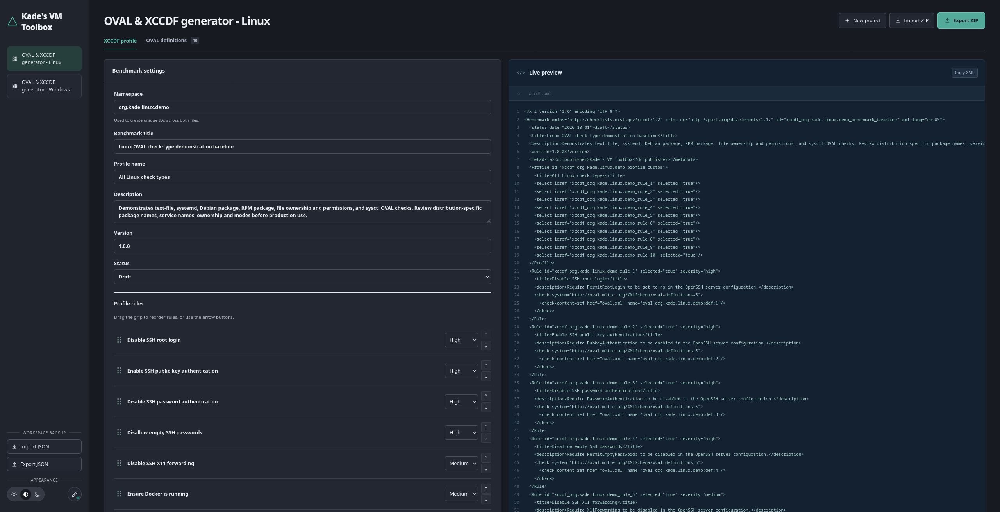

<div align="center">

# Kade's VM Toolbox

Build Linux compliance profiles visually, inspect the generated XML in real time, and export scanner-ready OVAL/XCCDF files without sending data to a server.

[](https://astro.build/)
[](https://svelte.dev/)
[](https://www.typescriptlang.org/)
[](Dockerfile)

</div>



Kade's VM Toolbox is a browser-based security-content editor for creating linked:

- **OVAL definitions**, which describe the configuration evidence a scanner should collect and test.
- **XCCDF benchmarks**, which organize those checks into named rules, severities, and a selectable profile.

The application is useful when you want to prototype compliance baseline or create content for validation in OpenSCAP or another compatible scanner (such as some of the Vulnerability Management solutions).

---
## How does the export look like

An export contains two files at the ZIP root:

```text
toolbox-profile.zip
├── oval.xml     # definitions, tests, objects and states
└── xccdf.xml    # benchmark, profile, rules and OVAL references
```

---
## Quick start with Docker Compose

```sh
docker compose up --build -d
docker compose ps
```

The app will be availaible on port `4173`:

```
http://localhost:4173.
```

---
## Manual

### 1. Install the requirements

- Git
- Node.js
- npm
### 2. Download and install the locked dependencies

```sh
git clone https://github.com/OWNER/REPOSITORY.git
cd REPOSITORY
npm ci
```
### 3. Verify the source

```sh
npm run check
npm test
npm audit
```
### 4. Start the development server

```sh
npm run dev
```

Open `http://localhost:4173`. Stop the server with `Ctrl+C`.

### 5. Build and preview the production site

```sh
npm run build
npm run preview
```

---

## Using an export with OpenSCAP

### Pre-requirements
On Ubuntu or Debian:

```sh
sudo apt update
sudo apt install openscap-scanner openscap-common openscap-utils
```

On Arch:

```sh
sudo pacman -S openscap
```

Extract the profile and enter its directory:

```sh
unzip toolbox-profile.zip -d toolbox-profile
cd toolbox-profile
```

### 1. Validate both XML documents

```sh
oscap oval validate oval.xml
oscap xccdf validate xccdf.xml
```
### 2. Find the generated profile ID

```sh
oscap info xccdf.xml
```

Look under `Profiles`, for example:

```text
Title: Ubuntu server hardening profile
    Id: xccdf_org.ubuntu_profile_custom
```

### 3. Evaluate the selected profile

```sh
sudo oscap xccdf eval --profile xccdf_org.ubuntu_profile_custom xccdf.xml
```

Replace the example profile ID with the exact ID shown by `oscap info`.

---